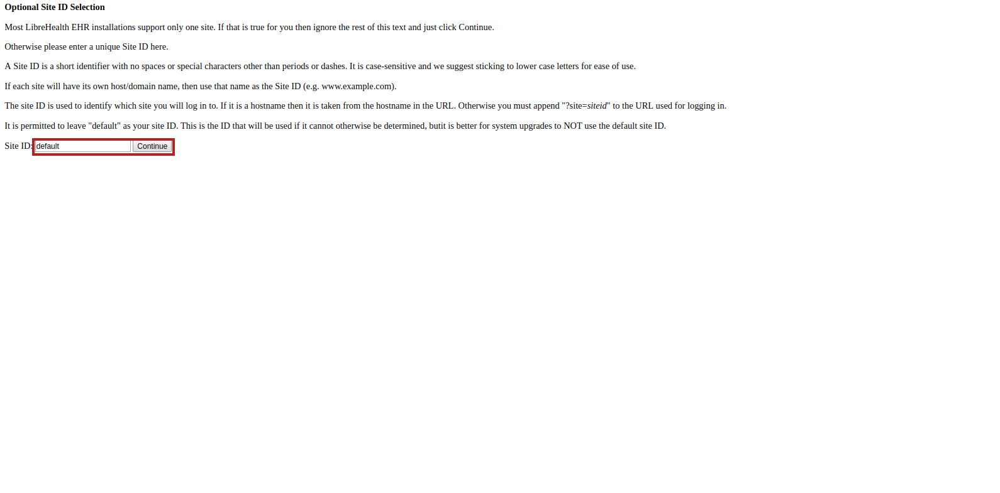
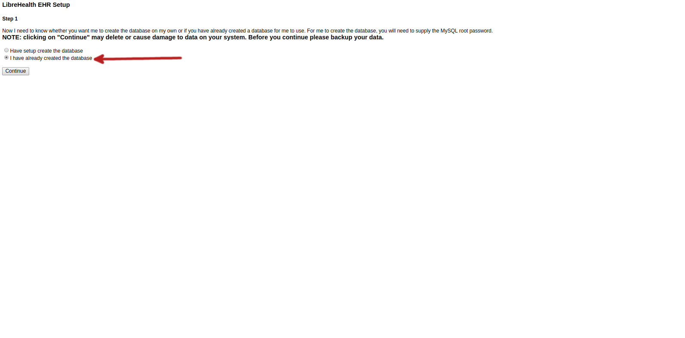
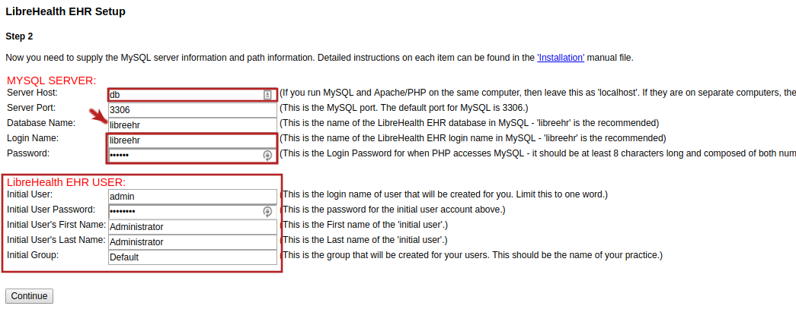
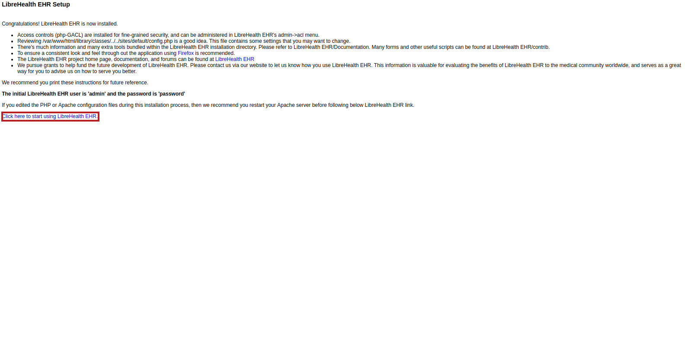

# `docker` support for LibreHealth EHR

**Table of Contents**

- [`docker` support for LibreHealth EHR](#docker-support-for-librehealth-ehr)
    - [Getting started](#getting-started)
        - [1. Install Composer, Docker and docker-compose (for ubuntu in this example)](#1-install-composer-docker-and-docker-compose-for-ubuntu-in-this-example)
        - [2. Get the source code (if not already)](#2-get-the-source-code-if-not-already)
        - [3. Configure the docker resources for LibreHealth EHR](#3-configure-the-docker-resources-for-librehealth-ehr)
        - [Ensure that your user is part of the `docker` user group](#ensure-that-your-user-is-part-of-the-docker-user-group)
            - [Development Start Up](#development-start-up)
            - [Production Start Up](#production-start-up)
        - [4. EHR Installation and setup](#4-ehr-installation-and-setup)
            - [Optional Site Selection](#optional-site-selection)
            - [Permission Checks](#permission-checks)
            - [Step 1](#step-1)
            - [Step 2](#step-2)
                - [MySQL database settings](#mysql-database-settings)
                - [LibreHealth EHR Settings](#librehealth-ehr-settings)
            - [Step 3](#step-3)
            - [Step 4](#step-4)
            - [Step 5](#step-5)
            - [Step 6](#step-6)
            - [Step 7](#step-7)
        - [5. Using LibreHealth EHR](#5-using-librehealth-ehr)
        - [If you did not have the initial dataset loaded](#if-you-did-not-have-the-initial-dataset-loaded)
        - [With the initial database with sample data](#with-the-initial-database-with-sample-data)
    - [Stopping the container](#stopping-the-container)
        - [Development](#development)
        - [Production](#production)
    - [Recreating the container](#recreating-the-container)
        - [Development](#development-1)
        - [Production](#production-1)
    - [Backup](#backup)
        - [Performing on-demand backup](#performing-on-demand-backup)
            - [on-demand backup](#on-demand-backup)
            - [Restoring from a backup](#restoring-from-a-backup)
    - [Updating LibreHealth EHR](#updating-librehealth-ehr)
    - [Accessing the Database using adminer](#accessing-the-database-using-adminer)
    - [Destroying it all (this is destructive)](#destroying-it-all-this-is-destructive)
        - [Production](#production-2)
        - [Development](#development-2)
    - [Viewing logs for a given container](#viewing-logs-for-a-given-container)
        - [Production](#production-3)
            - [For LibreHealth EHR](#for-librehealth-ehr)
            - [For MariaDB](#for-mariadb)
        - [Development](#development-3)
            - [For LibreHealth EHR](#for-librehealth-ehr-1)
            - [For MariaDB](#for-mariadb-1)

<!-- markdown-toc end -->


To start a simple `lh-ehr` instance, follow the steps:

## Getting started
### 1. Install Composer, Docker and docker-compose (for ubuntu in this example)

[Composer Getting Started](https://getcomposer.org/)

[Docker CE install Page](https://docs.docker.com/install/overview/)

[Docker Compose install Page](https://docs.docker.com/compose/install/#install-compose)

### 2. Get the source code (if not already)

    $ git clone https://github.com/LibreHealthIO/lh-ehr.git

### 3. Configure the docker resources for LibreHealth EHR

The librehealth_ehr container is configured for PHP 7.2 and Apache2.

The `docker/.env.ehr` contains the information for the EHR database itself. Database credentials should match those in `docker/.env.mysql`.

The `docker/.env.mysql` contains the mysql root password and the initial database information for setup. The database with the name specified by `MYSQL_DATABASE` will be created and access will be granted to the user specified by `MYSQL_USER`. A user will also be created with the username specified in `MYSQL_USER` and the password specified by `MYSQL_PASSWORD`.

We have created a bash script, which is geared towards production use currently that handles prompting for the credentials and creating the `docker/.env.ehr` and `docker/.env.mysql`.

We created a separate script for development use and that use is documented in this README. Both scripts have a `help` command, or by calling `docker/dev` or `docker/run` with no arguments.

It allows you manage the lifecycle of the containers for LibreHealth EHR.


**Note**: This is geared towards Linux users. You should install the [Windows Subsystem for Linux (WSL)](https://docs.microsoft.com/en-us/windows/wsl/install-win10) if you are using Windows 10.

``` bash
$ docker/run setup
```

This will do checks to ensure that everything needed to run is setup properly. We have configured this for Ubuntu-based systems.


### Ensure that your user is part of the `docker` user group

``` bash
  $ sudo usermod -aG docker your-user
```
:warning: In production, ensure you run the scripts as root.

:warning: You will need to logout and log back in again for this to take effect. No need to reboot, just logout and log back in.

#### Development Start Up

The developer install uses the default `docker-compose.yml` and will automatically import a demo database which is located in `sql/nhanes`
```bash
$ docker/dev setup
$ docker/dev start
```

The above will create the database with user and password as shown in the docker/.env.ehr file.

If you do not wish to use this, comment out the `- .sql/nhanes:/docker-entrypoint-initdb.d/`  Line in the `docker-compose.yml` file.

This will be ready to go if you used the initial database mentioned above. [Otherwise follow the setup instructions](#4-ehr-installation-and-setup).


#### Production Start Up

If you are setting up with an existing production database you will need to edit both the docker/.env files to contain the correct information for your existing database.


``` bash
$ docker/run start
```

**The initial container creation may take awhile.  After the container has been created give it a few more minutes to allow the services to start and then proceed as below.**

**Note**: replace `localhost:8000` with the IP of the server. Port might be different as well.

:warning: You should place this behind a reverse proxy with HTTPS if this is running remotely. This image does not include HTTPS support. :warning:

Now go to [http://localhost:8000](https://localhost:8000) and [proceed to step 5](#5-using-librehealth-ehr).

If you created a new database then the setup wizard will guide you through the installation steps. Instructions follow below for that.

### 4. EHR Installation and setup

#### Optional Site Selection



You should be able to leave this as `default` and press <kbd>Continue</kbd>

#### Permission Checks

Press <kbd>Continue</kbd> as everything is designed to be correct.


#### Step 1



Select "I have already created the database" as seen above and press  <kbd>Continue</kbd>

#### Step 2



Fields boxed in red are ones that should be filled out. The arrow to the Database name is due to the fact that it doesn't necessarily need to be changed.

##### MySQL database settings

The following are based off of `docker/.env.mysql`
- MySQL Server Host shold be `db`
- Port remains unchanged
- Database name should be whatever you set `MYSQL_DATABASE` to in `docker/.env.mysql`, default should be fine.
- Username should be whatever you set `MYSQL_USER` to in `docker/.env.mysql`
- Password should be changed from the default and should match what you set `MYSQL_PASSWORD` to in `docker/.env.mysql`

##### LibreHealth EHR Settings

The next section is for the initial administrative user for LibreHealth EHR. All fields should be changed according to the instructions.

When the above is completed, press <kbd>Continue</kbd>

#### Step 3

This step will take a bit to complete. When complete, press <kbd>Continue</kbd>.

#### Step 4

Just press <kbd>Continue</kbd>

#### Step 5

Just press <kbd>Continue</kbd>

#### Step 6

Just press <kbd>Continue</kbd>

#### Step 7



You should print this page and store it in a secure location.

Once done, follow the link which is boxed in red above.


### 5. Using LibreHealth EHR


### If you did not have the initial dataset loaded

Login with credentials provided above:
- Initial User: `<your admin user>`
- Initial User Password: `<your admin password>`


###  With the initial database with sample data

- Initial User: `admin`
- Initial User Password: `password`


## Stopping the container

### Development

``` bash
$ docker/dev stop
```
### Production

``` bash
$ docker/run stop
```

## Recreating the container

Since data is stored in volumes, the container can be re-created without issue.

### Development

``` bash
$ docker/dev rebuild
```
### Production

``` bash
$ docker/run rebuild
```

## Backup

Docker stores data that changes as volumes external from the containers. We create two volumes, shown below:

Currently we create two volumes.

| Name      | Purpose                                                                                                    |
|-----------|------------------------------------------------------------------------------------------------------------|
| `sites`   | Stores the `sites`, which is typically stores database configuration, as well as documents                 |
|  `db_data` | The data directory for `mariadb`                                                                           |


We make use of [lh-docker-cron-backup](https://gitlab.com/librehealth/lsc/lh-docker-cron-backup/), which automates nightly backups.

You should store these offsite somewhere secure. By default, the `sites`, and `db_data` volumes are backed up.

**The backups go to the `backups` directory in the top-level directory of the source tree, but can be configured to go anywhere by setting `BACKUP_DIR` in `docker/env.ehr`.**

Backups are scheduled and run using [cron](https://cron.guru).

The backup container is set to Universal Coordinated Time (UTC). If you want to run at midnight every night, you would do:

in `docker/.env.ehr` put `SCHEDULE=0 0 * * * `, an asterisk(`*`) denotes any value.

The above means:
```
0  => minute (0-59 is valid) at 0 minutes on the hour
0  => hour  (0-23 are valid) at 0 hour
* => day of month (0-31 are valid) - any day of the month
*  => month (1-12, JAN-DEC are valid) - any month
*  => day of week (0-6, SUN-SAT are valid) - any day of the week
```

### Performing on-demand backup

#### on-demand backup


```bash
$ docker/run backup
```

The backup will be placed in `backups/`.


#### Restoring from a backup

```
docker/run restore 2018-12-15_00-00-01
```

Where `2018-12-15_00-00-01` is the datestamp you wish to restore in the format: `YYYY-MM-DD_hh-mm-ss`, breaking this down:

```
- YYYY = 2018 (4 digit year)
- MM - 12  (2 digit month
- DD - 15 (2 digit day)
- hh - 00 (24 hour format -- in this case midnight)
- mm - 00 (00-59)
- ss - seconds (backups are stamped to the second)
```
For single-digit month/days/seconds do `00`,`01`,`02`,`03`,`04`,`05`,`06`,`07`,`08`,`09`

## Updating LibreHealth EHR

This is only applicable to production.

``` bash
$ docker/run update
```

Do not forget to run http://localhost:8000/sql_upgrade.php

**Replace `localhost:8000` with the port and, IP address or hostname of your server.**

## Accessing the Database using adminer

You can access the database using [adminer](https://www.adminer.org/ "Adminer is a database management tool") by going to http://localhost:8001

You will need your database credentials. Use the hostname `db` for the database server.

## Destroying it all (this is destructive)

:warning: This stops all containers, deletes the images, and all associated volumes. This should be used with care :warning:

### Production
``` bash
docker/run destroy
```

### Development

``` bash
docker/dev destroy
```
## Viewing logs for a given container

It is possible to view the logs for a given container.

### Production

#### For LibreHealth EHR

``` bash
docker/run logs lh-ehr
```
#### For MariaDB

``` bash
docker/run logs db
```

### Development

The commands are mirrored for development but use a different script.

#### For LibreHealth EHR

``` bash
docker/dev logs lh-ehr
```
#### For MariaDB

``` bash
docker/dev logs db
```
