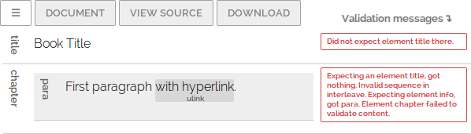

# Doctored.js

User-friendly XML editor (no brackets!) that can handle DocBook 5.

Project homepage with demo here: http://holloway.co.nz/doctored

## Documentation

[How to add a custom schema](doctored/schemas/README.md)
