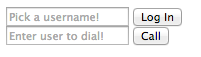
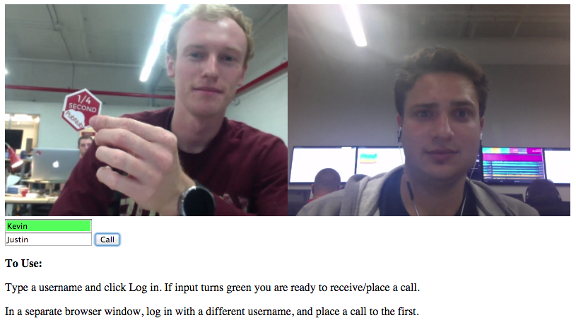

## WebRTC Video Chatting in 20 Lines of JS

WebRTC, so hot right now. If you don't know it, WebRTC is a free, open project that provides simple APIs for creating Real-Time Communications (RTC) for browsers and mobile devices. Essentially, it makes streaming any content such as video, audio, or arbitrary data simple and fast!

_NOTE:_

The following demo uses the PubNub WebRTC JavaScript API for signaling to transfer the metadata and establish the peer-to-peer connection. Once the connection is established, the video and voice runs on public Google STUN/TURN servers.

Keep in mind, PubNub can provide the signaling for WebRTC, and requires you to combine it with a hosted WebRTC solution. For more detail on what PubNub does, and what PubNub doesn’t do with WebRTC, check out this article: https://support.pubnub.com/support/solutions/articles/14000043715-does-pubnub-provide-webrtc-and-video-chat-

## Why PubNub? Signaling.

WebRTC is not a standalone API, it needs a signaling service to coordinate communication. Metadata needs to be sent between callers before a connection can be established. 

This metadata includes things such as:

- Session control messages to open and close connections
- Error messages
- Codecs/Codec settings, bandwidth and media types
- Keys to establish a secure connection
- Network data such as host IP and port

Once signaling has taken place, video/audio/data is streamed directly between clients, using WebRTC's `PeerConnection` API. This peer-to-peer direct connection allows you to stream high-bandwidth robust data, like video.

PubNub makes this signaling incredibly simple, and then gives you the power to do so much more with your WebRTC applications.

### Browser Compatibility

WebRTC is widely adopted by popular browsers such as Chrome and Firefox, but there are many browsers on which certain features will not work. See a list of [supported browsers here](http://iswebrtcreadyyet.com/).

## Part 1: A Simple WebRTC Video Chat

Time to begin! First I will show you how to make the bare minimum WebRTC video chat. Then, in Part 2 we will make use of a simple wrapper library to create a full featured video chatting application. The live demo of what you will be making in the next 2.5 minutes [can be found here](http://kevingleason.me/SimpleRTC/minivid.html)!

### A Note on Testing and Debugging

If you try to open `file://<your-webrtc-project>` in your browser, you will likely run into Cross-Origin Resource Sharing (CORS) errors since the browser will block your requests to use video and microphone features. To test your code you have a few options. You can upload your files to a web server, like [Github Pages](https://pages.github.com/) if you prefer. However, to keep development local, I recommend you setup a simple server using Python.

To so this, open your terminal and change directories into your current project and depending on your version of Python, run one of the following modules.

    cd <project-dir>

    # Python 2
    python -m SimpleHTTPServer <portNo>
    
    # Python 3
    python -m http.server <portNo>
    
For example, I run Python2.7 and the command I use is `python -m SimpleHTTPServer 8001`. Now I can go to `http://localhost:8001/index.html` to debug my app! Try making an `index.html` with anything in it and serve it on localhost before you continue.

### Step 1: The HTML5 Backbone

For the sake of the demo, let's keep the HTML short and simple. First we need a div to house our videos. Then, all we really need to start off with is a login field so you can specify your name and a call field so you can dial someone.

    <div id="vid-box"></div>

    <form name="loginForm" id="login" action="#" onsubmit="return login(this);">
        <input type="text" name="username" id="username" placeholder="Pick a username!" />
        <input type="submit" name="login_submit" value="Log In">
    </form>


    <form name="callForm" id="call" action="#" onsubmit="return makeCall(this);">
        <input type="text" name="number" placeholder="Enter user to dial!" />
        <input type="submit" value="Call"/>
    </form>
    
This should leave you with an elaborate, well styled HTML file that looks something like this:



### Step 2: The JavaScript Imports

There are three libraries that you will need to include to make WebRTC operations much easier. The first thing you should include is [jQuery](https://jquery.com/) to make modifying DOM elements a breeze. Then, you will need the PubNub JavaScript SDK to facilitate the WebRTC signaling. Finally, include the PubNub WebRTC SDK which makes placing phone calls as simple as calling the `dial(number)` function.

    <script src="https://ajax.googleapis.com/ajax/libs/jquery/2.1.3/jquery.min.js"></script>
    <script src="https://cdn.pubnub.com/pubnub.min.js"></script>
    <script src="http://kevingleason.me/SimpleRTC/js/webrtc.js"></script>

Now we are ready to write our calling functions for `login` and `makeCall`!

### Step 3: Preparing to Receive Calls

In order to start facilitating video calls, you will need a publish and subscribe key. To get your pub/sub keys, you’ll first need to [sign up for a PubNub account](http://www.pubnub.com/get-started/). Once you sign up, you can find your unique PubNub keys in the [PubNub Developer Dashboard](https://admin.pubnub.com). The free Sandbox tier should give you all the bandwidth you need to build and test your WebRTC Application.

First, lets use jQuery to find our video holder, where other callers faces will go.

    var video_out = document.getElementById("vid-box");

Now, to implement the login function. This function will set up the phone using the username they provided as a UUID.

```
function login(form) {
    var phone = window.phone = PHONE({
        number        : form.username.value || "Anonymous", // listen on username line else Anonymous
        publish_key   : 'your_pub_key',
        subscribe_key : 'your_sub_key',
    }); 
    phone.ready(function(){ form.username.style.background="#55ff5b"; });
    phone.receive(function(session){
        session.connected(function(session) { video_out.appendChild(session.video); });
        session.ended(function(session) { video_out.innerHTML=''; });
    });
    return false;   // So the form does not submit.
}
```

You can see we use the username as the phone's number, and instantiate PubNub using your own publish and subscribe keys. The next function `phone.ready` allows you to define a callback for when the phone is ready to place a call. I simply change the username input's background to green, but you can tailor this to your needs.

The `phone.receive` function allows you to define a callback that takes a session for when a session (call) event occurs, whether that be a new call, a call hangup, or for losing service, you attach those event handlers to the sessions in `phone.receive`. 

I defined `session.connected` which is called after receiving a call when you are ready to begin talking. I simple appended the session's video element to our video div. 

Then, I define `session.ended` which is called after invoking `phone.handup`. This is where you place end-call logic. I simply clear the video holder's innerHTML.

### Step 4: Making Calls

We now have a phone ready to receive a call, so it is time to create a `makeCall` function.

```
function makeCall(form){
    if (!window.phone) alert("Login First!");
    else phone.dial(form.number.value);
    return false;
}
```

If `window.phone` is undefined, we cannot place a call. This will happen if the user did not log in first. If it is, we use the `phone.dial` function which takes a number and an optional list of servers to place a call.



And that is it! You now have a simple WebRTC chatting app, fire up your python server and go test your app on localhost!

## Production Quality WebRTC with XirSys

While PubNub handles all the signaling for you WebRTC application, there are many other server side features that you will likely need to handle the quirks of real-world connectivity. In reality, most devices live behind layers of NAT, proxies, and corporate firewalls. [XirSys](http://xirsys.com/) is a WebRTC hosting company that provides production quality STUN and TURN servers to solve these problems. Sign up on their website to receive your free API key so you can start using using their solutions!

To use a XirSys server in your application, follow their [Quick Start Guide](http://xirsys.com/guide/) to make a domain. You will need to navigate to [this page](https://dashboard.xirsys.com/domains/list) and create a new domain. This domain will automatically be populated with an application “default” and a room “default” which we will use to get ICE servers.

ICE Servers can be gathered by placing a request to the XirSys API. __Note: Requires jQuery.__

```js
function get_xirsys_servers() {
    var servers;
    $.ajax({
        type: 'POST',
        url: 'https://service.xirsys.com/ice',
        data: {
            room: 'default',
            application: 'default',
            domain: 'your-domain',
            ident: 'your-ident',
            secret: 'Your API key, on dashboard',
            secure: 1,
        },
        success: function(res) {
            console.log(res);
            res = JSON.parse(res);
            if (!res.e) servers = res.d.iceServers;
        },
        async: false
    });
    return servers;
}
```

This will return the servers you can use to start a video chat with production quality dependency. The PubNub phone.dial and controller.dial have an optional argument of servers to use to place a call, so to use your servers, simply call it as follows: 

```
phone.dial(number, get_xirsys_servers());
```

If you are using the PubNub RTC-Controller, you can provide this function at creation time using:

```js
var phone = //...
var ctrl = CONTROLLER(phone, get_xirsys_servers);
```

All calls will automatically use the provided server function. You’re all ready to go now! Happy chatting!

### Want to learn more?

Good, that never-ending quest for knowledge will get you far in life. Here are some other resources PubNub offers on WebRTC:

[PubNub WebRTC SDK](https://github.com/stephenlb/webrtc-sdk)

[What is WebRTC](http://www.pubnub.com/blog/what-is-webrtc/)

[PubNub WebRTC Demo](http://www.pubnub.com/developers/demos/webrtc/)

We will be putting out more information and tricks of using WebRTC in the coming weeks so stay tuned!
